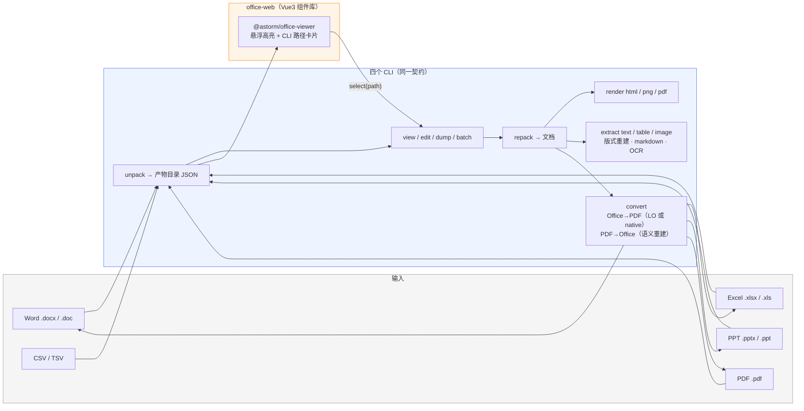

# astorm-office

[](LICENSE)
[](https://www.rust-lang.org)
[](https://github.com/hxuxingy1212/astorm-office/actions/workflows/ci.yml)
[](https://hxuxiny.gitee.io/astorm-office/)

**面向 AI Agent 的 Office 文档工具集**：生成 / 解析 / 精准编辑 / 高保真预览 **Word · Excel · PPT · PDF**，
并在 PDF 与 Office 之间互转。Rust 实现，直接操作 OOXML 与 PDF 对象，零 Office 运行时依赖；
四个 CLI 共享同一套 JSON 中间形态与命令契约，MCP / 常驻服务 / 批量回放开箱即用。

> 在线演示（四格式预览组件 + 悬浮路径卡片）：**[hxuxiny.gitee.io/astorm-office](https://hxuxiny.gitee.io/astorm-office/)**

## 为什么是这个样子

LLM 操作 Office 文档的常见痛点：直接改 XML 容易改坏包结构、没有可靠的"读回"机制、
三个格式三套心智模型、改完无法自验。astorm-office 的解法：

- **JSON 产物目录为唯一中间形态**——文档解包为人类可读的 JSON（`document.json` +
  分片 + 媒体），改完 `repack` 重建为二进制文档，包结构由 CLI 保证合法；
- **两层工具面**——`view`（省 token 的文本/结构视图）负责读，`edit get/set/add/remove`
  （1 基树形路径，docx 支持 `@paraId=` 稳定寻址）负责改，路径语法四格式一致；
- **自验闭环**——`render` 导出 HTML / PDF / PNG，生成后立即目视核对；web 预览组件
  悬浮任意元素直接显示其 CLI 路径，所见即可寻址；
- **无状态契约**——stdout 只出数据（可 `jq`），状态走 stderr；写操作必须 `-o` 输出新文件；
  退出码 `0/1/2/3` 语义统一；`schema --json` 由 Rust 类型自动生成（CI 强制一致）。

## 概览

- **四格式统一**：`json2docx` / `json2xlsx` / `json2pptx` / `json2pdf` 一个心智模型
- **PDF ↔ Office 互转**：产物目录为中间形态的架构内映射，语义重建，不依赖 LibreOffice
- **内容提取**：`extract text` 支持版式重建（XY-cut 多栏阅读序）/ markdown / 扫描件 OCR
  （引擎链：HTTP OCR 服务 → macOS 系统 Vision → tesseract 兜底，均为可选）
- **公式与图表**：Word LaTeX→OMML 公式、Excel 公式求值器/透视表/条件格式、PPT 22 种元素
- **旧版格式**：`.doc` / `.xls` / `.ppt` 直接读，双引擎转新格式（LibreOffice 保真 / 纯 Rust 兜底）
- **服务化**：`serve` 常驻编辑（stdin JSON 行）、`mcp` stdio JSON-RPC、`batch` 批量回放
- **预览组件**：`@astorm/office-viewer` Vue3 组件库，四格式 macOS 风格预览，
  悬浮高亮元素并弹出 CLI 路径卡片；行虚拟滚动支撑百万行表格



## 项目一览

| 目录 | 交付物 | 目标格式 | 说明 |
|---|---|---|---|
| [`ai-word/`](ai-word/) | `json2docx` | Word `.docx` | 专业长文档（论文/报告/合同/简历）：MCP、常驻编辑、模板提取与数据填充、公式（LaTeX→OMML） |
| [`ai-excel/`](ai-excel/) | `json2xlsx` | Excel `.xlsx` | 报表/数据工作簿：公式求值器、CSV 导入、图表/透视表/条件格式、16 套风格模板 |
| [`ai-ppt/`](ai-ppt/) | `json2pptx` | PowerPoint `.pptx` | 演示文稿：22 种元素、6 套模板预设、web 预览编辑器（`web/` + `web-server/`） |
| [`ai-pdf/`](ai-pdf/) | `json2pdf` | PDF `.pdf` | PDF 工具箱：产物目录双向解析与 **view/edit/render 全链路**（8 种元素/内嵌字体/全滤镜图片解码 JPX·JBIG2·CCITT）、**PDF ↔ Word/Excel/PPT 互转**（语义重建，不依赖 LibreOffice）、文本表格提取（版式重建 / markdown / 扫描件 OCR）、页操作、AcroForm、Office/HTML/LaTeX 转 PDF、调色板与设计引擎、qa 体检 |
| [`office-web/`](office-web/) | `@astorm/office-viewer` | DOCX / XLSX / PPTX / PDF | **四格式高保真预览 Vue3 组件库**：悬浮高亮元素并弹出 CLI 路径卡片；行虚拟滚动（百万行滚动渲染 6~12ms） |
| [`office-core/`](office-core/) | `office-core` | — | 共享基础层：OPC 部件读写、LibreOffice 转换引擎、统一 CLI 输出契约 |

## 快速开始

要求 Rust 1.75+：

```bash
git clone git@gitee.com:hxuxiny/astorm-office.git    # 或 GitHub 镜像 hxuxingy1212/astorm-office
cd astorm-office

cargo build --release          # 构建四个 CLI：target/release/json2docx|json2xlsx|json2pptx|json2pdf
cargo install --path ai-word/cli    # 或按需安装某一格式（其余同理）
```

三步工作流（以 Word 为例，Excel / PPT / PDF 完全同构）：

```bash
json2docx unpack in.docx -o paper/           # ① 解包为 JSON 产物目录
json2docx edit paper/ '/part[1]/paragraph[2]' set --prop text=新内容
json2docx repack paper/ -o out.docx          # ③ 重建为二进制文档（自动校验）
json2docx render out.docx / -o preview.pdf   # 自验：渲染出图目视核对
```

PDF（寻址为纯索引制 `/page[N]/text[K]`）：

```bash
json2pdf unpack in.pdf -o doc/               # PDF → 产物目录（document.json + pages/ + media/ + fonts/）
json2pdf view doc/ '/page[1]' text           # 文本+媒体视图（每项带 CLI 路径）
json2pdf edit doc/ '/page[1]/text[2]' set --prop 'text=新内容'
json2pdf render doc/ -o preview.html         # 自验：目视核对（png/pdf 需 Chrome）
json2pdf repack doc/ -o out.pdf              # 产物目录 → PDF
json2pdf qa out.pdf                          # 终检：体检报告（问题退出码 3）
```

跨格式互转（详见 [`ai-pdf/README.md`](ai-pdf/README.md) 的"跨格式转换"节）：

```bash
json2pdf convert docx in.pdf -o out.docx     # PDF → 可编辑 Word：标题/段落/列表/表格/图片语义重建
json2pdf convert pptx in.pdf -o out.pptx     # PDF → PPT：页→slide 绝对定位近无损
json2pdf convert xlsx in.pdf -o out.xlsx     # PDF → Excel：识别表格逐张成 sheet
json2pdf convert office out.docx -o out.pdf  # Office → PDF：探测到 LibreOffice 即用，否则 native 自研
```

从零生成：按 schema 写产物目录（或 `templates` / `extract` 取模板、`merge` 填充数据）后 `repack`。
agent 技能使用统一总纲 [`skill/SKILL.md`](skill/SKILL.md)（通用契约 + 工作流 + 分层索引到各格式分册与深度参考）；
`json2xxx batch` 提供 stdio JSON-RPC（MCP）接入，`serve` 提供常驻编辑服务。

## Web 高保真预览（`@astorm/office-viewer`）

Vue3 组件库，输入是 `unpack` 产物的 JSON，输出四格式 macOS 风格预览：

```ts
import { OfficeViewer, loadProduct } from '@astorm/office-viewer'
import '@astorm/office-viewer/style.css'

// 悬浮任意元素：高亮 + 路径卡片（元素名 + CLI 路径 + 内容摘要）
// 点击：select 事件回传路径，可直接喂给 edit / batch
<OfficeViewer kind="pptx" :data="deck" @select="(path) => editWithCli(path)" />
```

- **预览与命令行共享同一套寻址语法**——所见即可寻址；
- 四格式布局：DOCX 全文目录 + 纸页、PPTX 缩略图 + 舞台、XLSX sheet 栏 + 缩放、PDF 页面缩略图 + 舞台；
- **大表性能**：行虚拟滚动 + 列式打包 + 流式解析，100 万行 × 6 列首屏毫秒级、
  滚动渲染 6~12ms、堆占用降至约 1/3；
- 交付形态：`dist/office-viewer.js + .css + index.d.ts`（vue / echarts 为 peer），
  完整 Props / Events / 接入说明与免安装示例见 [`office-web/README.md`](office-web/README.md)。

**在线预览网址**：https://hxuxiny.gitee.io/astorm-office/

> 由 `pages` 分支发布（内容 = `office-web/dist-demo` 构建产物）。首次启用：仓库
> **服务 → Gitee Pages**，部署分支选 `pages`、目录 `/`；此后 demo 更新只需跑
> `office-web/scripts/deploy-pages.sh` → `git push origin pages` → 在 Gitee 页面点
> "重新部署"（免费版不自动重建）。若镜像到 GitHub（`hxuxingy1212/astorm-office`），
> push `main` 会经 [`.github/workflows/pages.yml`](.github/workflows/pages.yml) 自动启用
> 并发布 Pages：https://hxuxingy1212.github.io/astorm-office/ 。本地等价验证：
> `cd office-web && npm run build:demo && npm run preview` → http://localhost:4173

## 旧版格式（.doc / .xls / .ppt）

三个 CLI 原生支持旧版 Office 二进制格式：parse 入口自动识别 OLE2/CFB 魔数直接 `view` / `edit`；
`convert` 命令双引擎转新格式，`--engine auto`（默认）探测到 LibreOffice 即用：

| 引擎 | 外部依赖 | 保真度 | 说明 |
| --- | --- | --- | --- |
| `libreoffice` | 本机 LibreOffice（自动探测，不随工具分发） | ★★★★☆ 填充/边框/列宽/图片/4:3 画布/标题格式/背景渐变均保留；WMF 自动光栅化 | 追求保真（默认） |
| `rust`（calamine / rwml / office_oxide，增量 <3.5 MB） | 无 | ★★☆~★★★☆ 值/公式/结构可保留，样式大部分丢失 | 纯离线环境 |

```bash
json2docx convert old.doc -o new.docx        # auto：检测到 LibreOffice 即用
json2xlsx convert old.xls --engine rust      # 强制纯 Rust
```

保真度以 govdocs1 真实语料抽样（每格式 6 份 vs LibreOffice 参照渲染）逐份目视比对验证；
选型、双引擎实测与已知限制见 [`docs/legacy-formats.md`](docs/legacy-formats.md)。

## 文档

| 文档 | 内容 |
| --- | --- |
| [`docs/cli-conventions.md`](docs/cli-conventions.md) | 四个 CLI 的统一契约（命令面 / I/O / 退出码 / 寻址），权威 |
| [`docs/legacy-formats.md`](docs/legacy-formats.md) | 旧格式选型、双引擎与保真度实测 |
| [`ai-pdf/README.md`](ai-pdf/README.md) | PDF 工具箱：互转 / 提取进阶（版式/markdown/OCR）/ 保真度边界 |
| [`ai-pdf/docs/eval-2026-10.md`](ai-pdf/docs/eval-2026-10.md) | PDF 产物目录重建保真度评估（govdocs1 真实语料抽样） |
| [`skill/SKILL.md`](skill/SKILL.md) | agent 技能统一总纲（通用契约 + 工作流 + 三层索引到格式分册） |
| [`office-web/README.md`](office-web/README.md) | 预览组件库完整文档（布局 / Props / Events / 路径卡片 / 性能） |
| `ai-*/skill/` | 各格式分册与深度参考（cli.md / schema.json / templates / scenarios），由统一总纲索引 |

## 目录结构

```text
astorm-office/
├── Cargo.toml            # workspace 根（统一依赖版本与 lint 策略）
├── office-core/          # 共享基础层（OPC 读写 / soffice 转换引擎 / Output 契约）
├── ai-word/              # json2docx 库 + cli/ + skill/
├── ai-excel/             # json2xlsx 库 + cli/ + skill/ + tests/corpus 真实语料
├── ai-ppt/               # json2pptx 库 + cli/ + skill/ + web/ + web-server/
├── ai-pdf/               # json2pdf 库 + cli/ + skill/ + docs/ 评估数据
├── office-web/           # 四格式预览组件库（Vue3 lib）+ demo 演示站 + examples/
├── docs/                 # cli-conventions.md（统一契约）/ legacy-formats.md（旧格式选型与实测）
└── .github/workflows/    # CI：fmt / clippy / test / schema 一致性 / web 构建 / Pages 部署
```

## 开发

```bash
cargo build --release          # 四个 CLI
cargo test                     # 全量 Rust 测试（含 CLI 契约测试）
cargo clippy --workspace --all-targets -- -D warnings
cargo fmt --all --check

cd office-web && npm install
npm test && npm run build      # 预览组件库：单测 + 构建（js/css/d.ts）
npm run dev                    # 演示站开发模式 http://localhost:5178
npm run build:demo && npm run preview    # 预览构建产物 http://localhost:4173（同 Pages 线上形态）
npm run example                # 外部接入示例 http://localhost:5188
```

开发约定：

- 提交前跑 `cargo fmt --all && cargo clippy --workspace --all-targets -- -D warnings && cargo test`；
- 修改数据模型后重新生成 schema：
  `cargo run -p json2docx-cli -- schema --json > ai-word/skill/references/schema.json`（四个项目同理），
  CI 校验一致性；
- 各项目文档以 `--help` 与代码为准；README / `skill/references/cli.md` 随 CLI 变更同步更新。

## 许可证

MIT

## 鸣谢

设计与实现的直接灵感与依赖：

- [liteparse](https://github.com/run-llama/liteparse) —— OCR 触发策略（selective OCR）、
  文本去重与 markdown 管线思路、OCR HTTP API 规范
- [lopdf](https://crates.io/crates/lopdf) —— PDF 对象层 / 压缩 / 字体表基座（其上自研
  内容流 tokenizer、文本状态机、ToUnicode 解析等）
- [calamine](https://crates.io/crates/calamine) / [rwml](https://docs.rs/rwml) /
  [office_oxide](https://crates.io/crates/office_oxide) —— 旧版 Office 二进制解析
- [openjp2-pure-rs](https://crates.io/crates/openjpeg2-pure-rs) /
  [hayro-jbig2](https://crates.io/crates/hayro-jbig2) /
  [hayro-ccitt](https://crates.io/crates/hayro-ccitt) —— JPX / JBIG2 / CCITT 图片解码
- [objc2](https://github.com/madsmtm/objc2)（objc2-vision）—— macOS 系统 OCR 绑定
- [vue](https://vuejs.org) / [vite](https://vite.dev) / [echarts](https://echarts.apache.org) —— 预览组件库
- 架构与命令行形态参考 [slidej](https://github.com/H4pplness/slidej) 与 OfficeCLI 的
  batch / help / 错误自愈建议等设计
